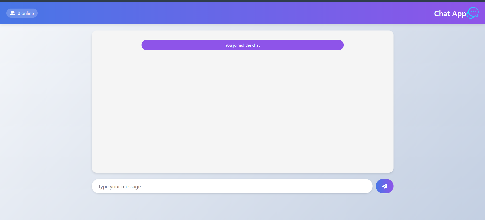

# Real-Time Chat Application

A modern real-time chat application built with HTML, CSS, and JavaScript using WebSockets for instant communication.

## Features

🚀 **Real-time messaging** - Instant message delivery using WebSocket technology  
👥 **User presence** - See who's online with live user count  
🔔 **Notifications** - Sound alerts for new messages and user activity  
💬 **Message history** - View previous messages in the chat  
⏱ **Timestamps** - See when messages were sent  
🎨 **Responsive design** - Works on both desktop and mobile devices  

## Technologies Used

- **Frontend**: HTML5, CSS3, JavaScript (ES6)
- **Backend**: Node.js with Socket.IO (WebSockets)
- **Deployment**: Local server setup
